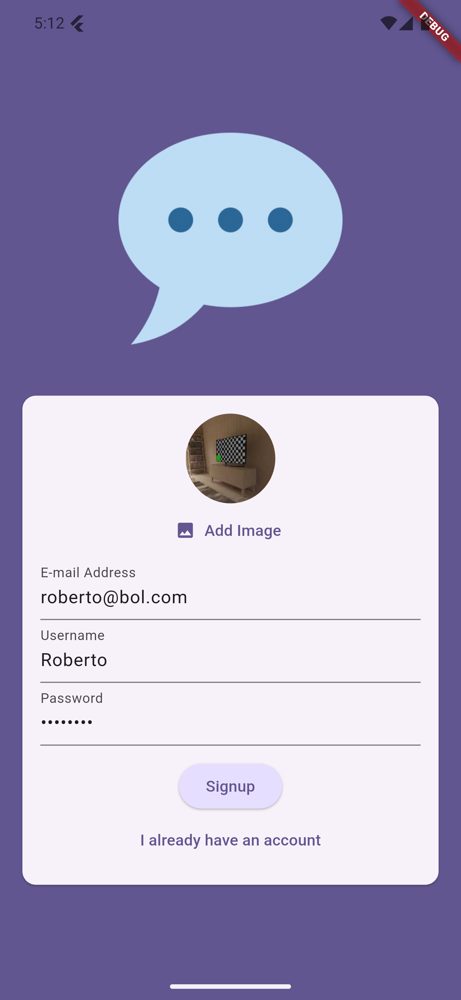
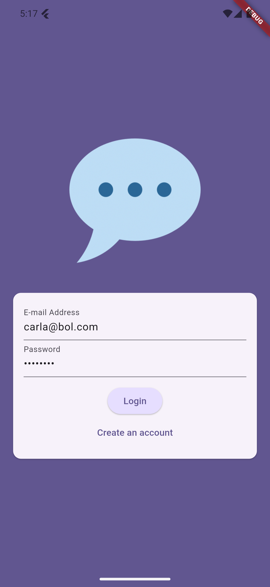
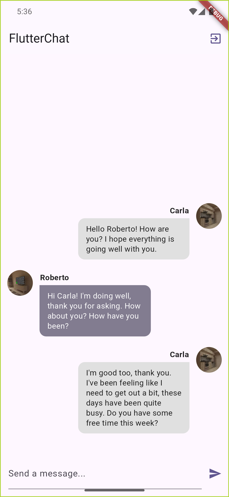
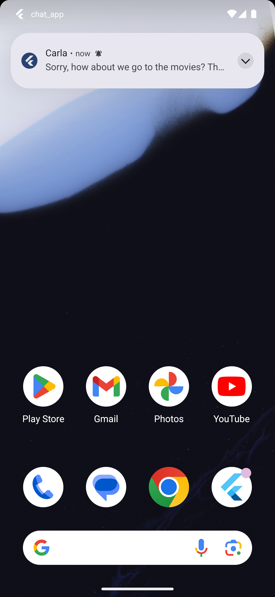
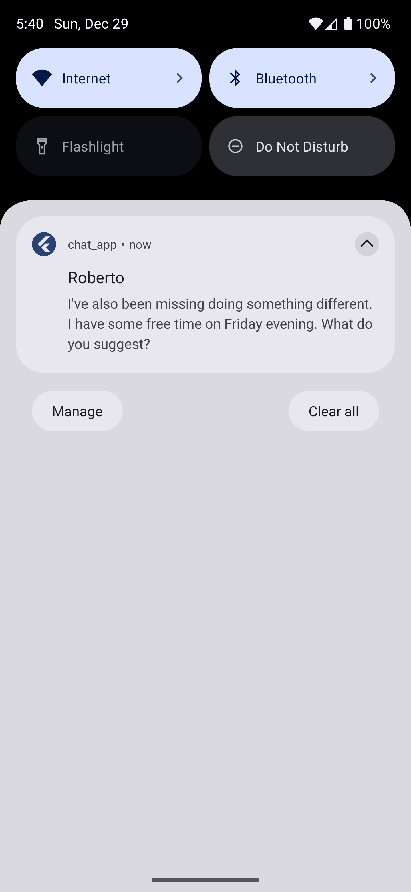

# Chat App with Flutter & Firebase

A Flutter application that allows users to chat in real-time, with push notifications, email authentication, and backend logic powered by Firebase and Google Functions.

## 🖼️ Screenshots

|  |  |  |
|----------------------|----------------------|----------------------|
|  |  | 

## 📋 Description

**Chat App** is a real-time messaging application built with Flutter and Firebase, which provides:

- **Real-time chat**: Users can send and receive messages instantly.
- Push notifications: Receive notifications when a new message is sent.
- Email authentication: Sign up and log in with email and password using Firebase Authentication.
- Cloud storage: Store messages and media in Firebase Firestore and Firebase Storage.
- Secure & scalable: Built with Firebase security rules and scalability in mind.

## 🛠️ Features

1. **Real-time messaging**:
   - Send and receive messages in real-time using Firebase Firestore.

2. **Push notifications**:
   - Notifications sent through Firebase Cloud Messaging when new messages arrive.

3. **Authentication**:
   - Users can send images in chat using Firebase Storage.

4. **Firebase App Check**:
   - Secure the Firebase services with Firebase App Check to prevent unauthorized access.

5. **Image sharing**:
   - Users can send images in chat using Firebase Storage.

6. **Google Functions**:
   - Custom backend logic powered by Google Functions.

## 📱 Technologies Used

- **Flutter**: Framework for cross-platform development.
- **Firebase Authentication**: Manage user authentication with email and password.
- **Firebase Authentication**: Manage user authentication with email and password.
- **Cloud Firestore**: Real-time database for storing chat messages.
- **Firebase Cloud Messaging**: Push notifications for real-time updates.
- **Firebase Storage**: Store images and other media.
- **Firebase App Check**: Enhance security.
- **Google Functions**: Serverless backend for custom logic and notifications.
- **Image Picker**: To pick images from the device.

## 🚀 How to Run the Project

1. **Clone the repository**:
   
bash
   git clone https://github.com/jamison0902/flutter-chat.git

2. **Install dependencies**:
bash
   flutter pub get

3. **Set up Firebase**:

    - Create a Firebase project in the Firebase Console.
    - Enable Firebase Authentication (Email/Password).
    - Set up Firebase Cloud Firestore and Firebase Storage.
    - Configure Firebase Cloud Messaging and Firebase App Check.
    - Perform the necessary configurations for Android and iOS using the credentials provided by Firebase, as described in the official documentation.

4. **Run the project**:
    
bash
   flutter run
